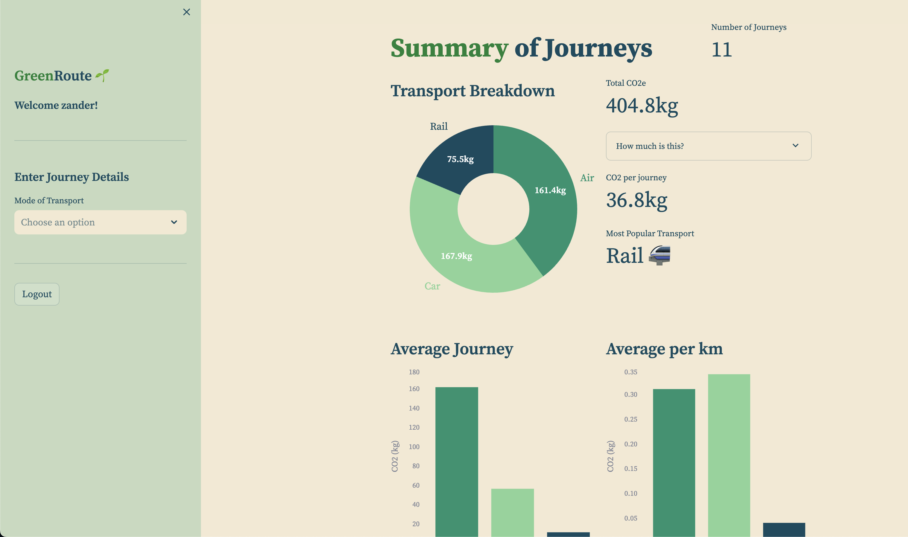

# GreenRoute 🌱
A project designed to make people more aware of the carbon footprint associated with their travel habits.

## 📊 Dashboard
The dashboard can currently be accessed [here](https://greenroute.streamlit.app/)
### Login Page
- Here, users can log in or sign up for an account


### Journey Spotlight
- Upon logging in, users now have access to a personalised dashboard
- Users can enter a journey in the sidebar. Current forms of transport allowed are:
    - Car (UK locations only)
    - Train (UK locations only)
    - Flight (worldwide)

- After submitting a journey, a breakdown will be shown in the **Journey Spotlight** section
- Users can also delete submitted journeys in this section


### Summary of Journeys
- Finally, a summary of submitted journeys is shown here, including a comparison between transport methods, total CO2 emissions, and average emissions



## 🛠️ Infrastructure
- Navigate to the `terraform` folder
- Create a `terraform.tfvars` file with the following keys
```
PUBLIC_KEY = 
PRIVATE_KEY = 
ORG_ID = 
AWS_REGION = 
DB_USERNAME = 
DB_PASSWORD = 
```
- To provision the MongoDB cluster, run `terraform init` followed by `terraform apply`

## ⚙️ Setup
- Activate a new virtual environment
- Install project dependencies using `pip install -r requirements.txt`
- Obtain an API key from [Climatiq](https://www.climatiq.io/)
- Create a MongoDB cluster, with a database containing two collections named `journeys` and `users`
- Create a `.env` file with the following keys filled out:
```
API_KEY=
DB_URL=
```

## 🏃 Running the dashboard
- Run the command `streamlit run dashboard.py`

## 📦 Data Storage
- All data is stored in a MongoDB database in the cloud