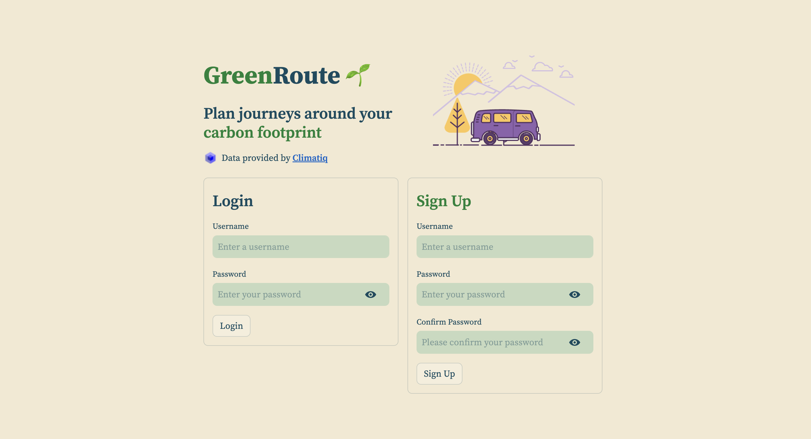
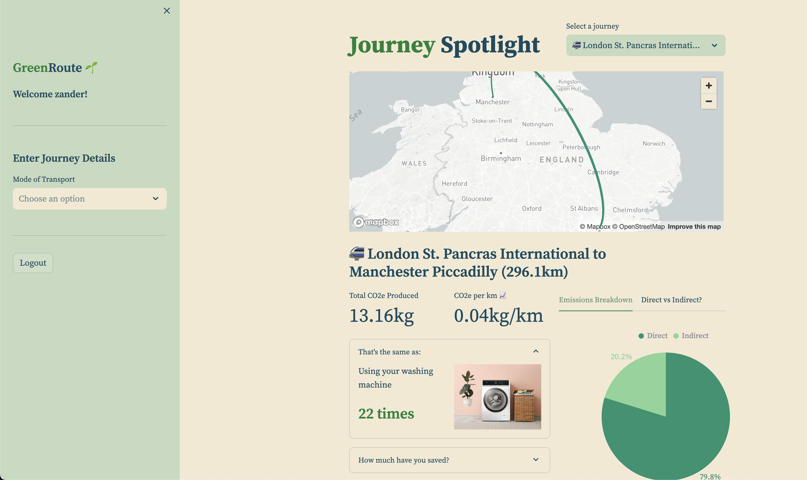

# GreenRoute 🌱
A project designed to make people more aware of the carbon footprint associated with their travel habits.

## 📊 Dashboard
The dashboard can currently be accessed [here](https://greenroute.streamlit.app/)
### Login Page


### Main Page


## ⚙️ Setup
- Activate a new virtual environment
- Install project dependencies using `pip install -r requirements.txt`
- Obtain an API key from [Climatiq](https://www.climatiq.io/)
- Create a MongoDB cluster, with a database containing two collections named `journeys` and `users`
- Create a `.env` file with the following keys filled out:
```
API_KEY=
DB_URL=
```

## 🏃 Running the dashboard
- Run the command `streamlit run dashboard.py`

## 📦 Data Storage
- All data is stored in a MongoDB database in the cloud